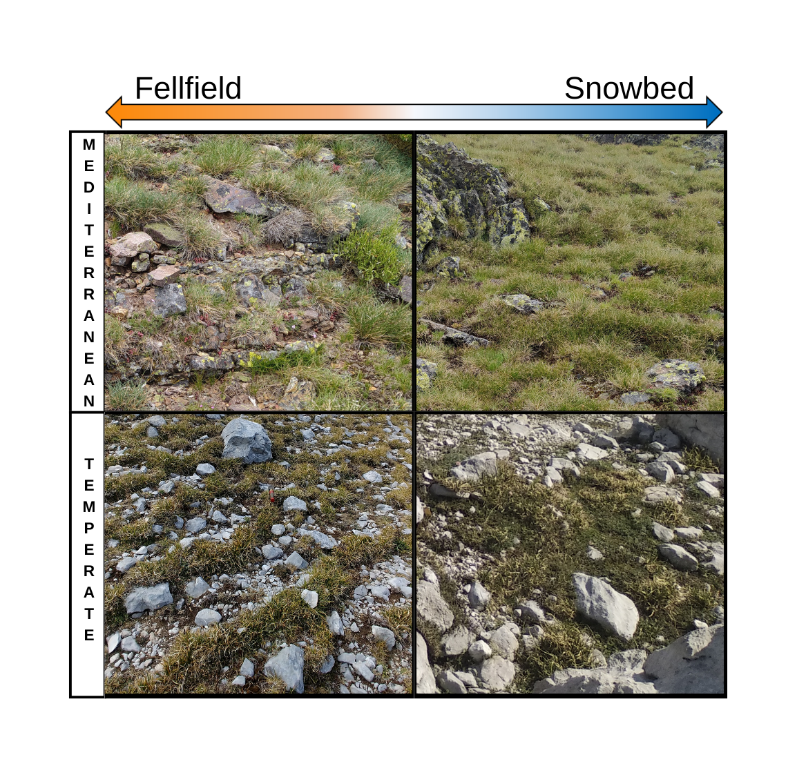

```{r setup, include=FALSE}
knitr::opts_chunk$set(echo = TRUE)
```

[](https://zenodo.org/doi/10.5281/zenodo.11242675)



# Microclimate regulates germination phenology in alpine plant communities

This repository stores all the information related to the manuscript [*Microclimatic regulation of germination phenology in alpine plants*](add doi once manuscript is accepted), including the raw datasets, the scripts to perform data cleaning, analysis and figures. 

## Contents

This repository is organised following the advice of [Wilson et al. 2017](https://doi.org/10.1371/journal.pcbi.1005510) for recording and storing research projects.


The following materials are available in the folders of this repository:

* `data` Data files including the 
[Raw germination data from the laboratory experiments](https://github.com/clara-espinosa/Germination_phenology/blob/main/data/clean%20data.csv) and 
[Germination data from the field sowing experiments](https://github.com/clara-espinosa/Germination_phenology/blob/main/data/field_germination.csv), 
[Species information](https://github.com/clara-espinosa/Germination_phenology/blob/main/data/all_info.csv) datasets;  [CHELSA bioclimatic variables for the study system](https://github.com/clara-espinosa/Germination_phenology/blob/main/data/Bioclim_study_area.csv) for figure 1b, 
[Temperatures recorded in the field from 2008 to 2019](https://github.com/clara-espinosa/Germination_phenology/blob/main/data/temp_picos_raw.csv) then  transformed into [Weekly temperature records for visualization](https://github.com/clara-espinosa/Germination_phenology/blob/main/data/weekly_picos_graph.csv) in figure 1c and 
[Temperatures programs used in growth chambers](https://github.com/clara-espinosa/Germination_phenology/blob/main/data/date_temp.csv) for figure 1d.
It also includes the [Mean germination trait values table ](https://github.com/clara-espinosa/Germination_phenology/blob/main/data/meanvalues_graph.csv) and the [Efects sizes from MCMC-GLMM models](https://github.com/clara-espinosa/Germination_phenology/blob/main/data/test_effectsize.csv) for figure 4.
Finally a [Metadata file](https://github.com/clara-espinosa/Germination_phenology/blob/main/data/metadata.csv) explaining each csv variables. 
* `doc` Preprint of the manuscript,
* `results` Output of the `R` scripts, including figures,models and phylogenetic trees.
* `src` Scripts in `R` language used to clean the raw data, perform the analyses of the manuscript and create the figures.

## Abstract

* **Background** . In most terrestrial plants, regeneration depends on the ability of seeds to germinate at the most favourable climatic conditions. Understanding seed germination phenology is thus crucial for predicting plant responses to environmental changes. However, a substantial gap persists regarding how microclimatic conditions influence germination in seasonal ecosystems.    
* **Methods** Here, we investigate the germination phenology of alpine plants in snow-related microclimates as a tool for predicting the resilience of plant communities to climate change. We conducted a continuous seasonal experiment with fresh seeds to investigate germination phenology in 54 co-occurring species from temperate and Mediterranean alpine communities. Using long-term field microclimatic data series, we precisely mimicked two contrasting microclimatic conditions: (1) windy exposed edges with snow-free period in winter and warmer temperatures in summer (“fellfield”) and (2) sheltered areas with lengthy snow cover and cooler temperatures (“snowbed”) in growth chambers. We validated the laboratory results with field sowing experiments to provide a complete picture of germination phenology.  
* **Key Results** The analysis of phenology traits demonstrated that both communities displayed similar responses to microclimatic variation. Accumulated microclimatic differences of 2-3 degrees Celsius a week, across a whole year in the laboratory, resulted in a quantifiable germination phenology delay, with an average of 60 and 45 days in snowbed conditions. The results from climatic chambers under realistic microclimatic conditions were consistent with the germination phenology registered from field experiments. We also observed macroclimatic effects resulting in reduced dormancy and increased autumn germination in Mediterranean alpine species. 
* **Synthesis** This study combines novel laboratory and field experimentation to tackle the understudied topic of germination phenology in habitats with sharp microclimatic gradients. Specifically, our findings suggest a predictable phenological shift in the germination of alpine plants along microclimatic gradients. In warmer conditions with reduced snow cover, alpine species are expected to advance germination 52 days on average, with potential disrupting effects on cold-adapted plant communities. This highlights the role of germination phenology to determine plant-environmental relationships in mid-latitude ecosystems, with strong impact on plant establishment and extinction risks under local microclimatic gradients.

## Citation

Please cite the repository, datasets and article as (to complete once manuscript has been accepted for publication): 
